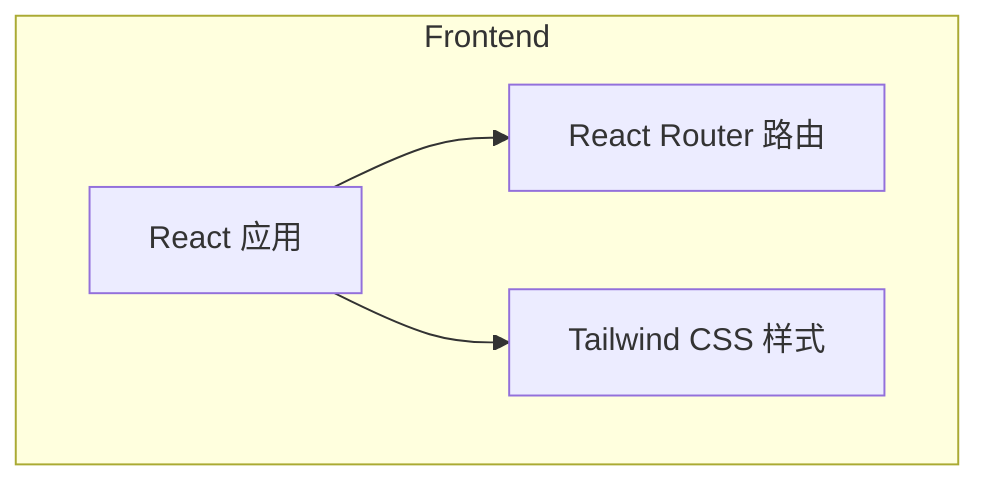

## 1. Architecture Design

## 2. Technology Description
- 前端：React@18 + TypeScript + tailwindcss@3 + vite
- 初始化工具：vite-init
- 后端：无（纯前端应用）
- 数据库：无

## 3. Route Definitions
| Route | Purpose |
|-------|---------|
| / | 首页 |
| /about | 关于页面 |

## 4. API Definitions
无后端API

## 5. Server Architecture Diagram
不适用（纯前端应用）

## 6. Data Model
不适用（无数据库）
