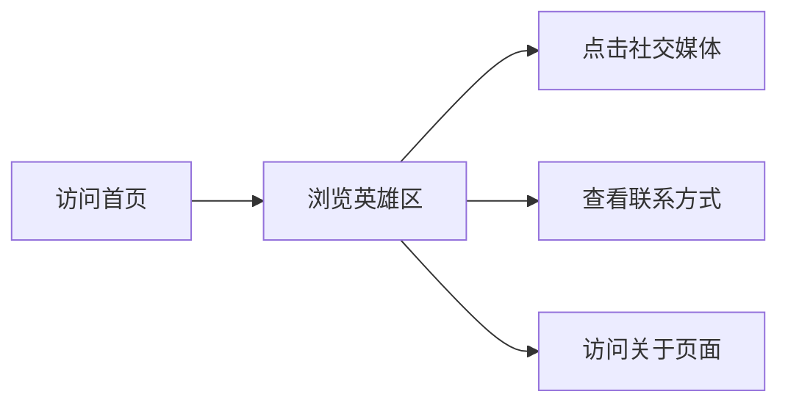

## 1. Product Overview
一个简单美观的个人展示网页，用于在互联网上展示个人信息。
- 主要用途：展示个人介绍、联系方式、社交媒体链接，提供一个简单的个人主页
- 目标用户：需要一个个人网页的任何人

## 2. Core Features

### 2.1 Feature Module
1. **首页**: 英雄区、个人介绍、社交媒体链接、联系方式
2. **关于页面**: 更详细的个人介绍

### 2.3 Page Details
| Page Name | Module Name | Feature description |
|-----------|-------------|---------------------|
| 首页 | 英雄区 | 显示欢迎信息、个人头像和简短介绍，带有平滑的动画效果 |
| 首页 | 社交媒体链接 | 提供多个社交媒体平台的链接，图标风格统一 |
| 首页 | 联系方式 | 显示邮箱等联系方式 |
| 关于页面 | 个人介绍 | 更详细的个人背景介绍、兴趣爱好等 |

## 3. Core Process
用户访问首页 → 浏览英雄区信息 → 点击社交媒体链接或查看联系方式 → 可访问关于页面了解更多详情

## 4. User Interface Design
### 4.1 Design Style
- 主色调：深蓝色 (#1e3a8a)，次要色：青色 (#06b6d4)
- 按钮风格：圆角按钮，带有轻微阴影和悬停效果
- 字体：使用现代无衬线字体，标题大而醒目
- 布局风格：卡片式布局，顶部导航栏
- 图标风格：使用简洁的线性图标

### 4.2 Page Design Overview
| Page Name | Module Name | UI Elements |
|-----------|-------------|-------------|
| 首页 | 英雄区 | 渐变背景，居中布局，大标题，副标题，动画效果 |
| 首页 | 社交媒体链接 | 网格布局，彩色图标，悬停放大效果 |
| 首页 | 联系方式 | 卡片式设计，清晰的标签和内容 |
| 关于页面 | 个人介绍 | 多段文本，分段展示，适当的间距 |

### 4.3 Responsiveness
桌面优先设计，适配移动设备，触摸优化。
