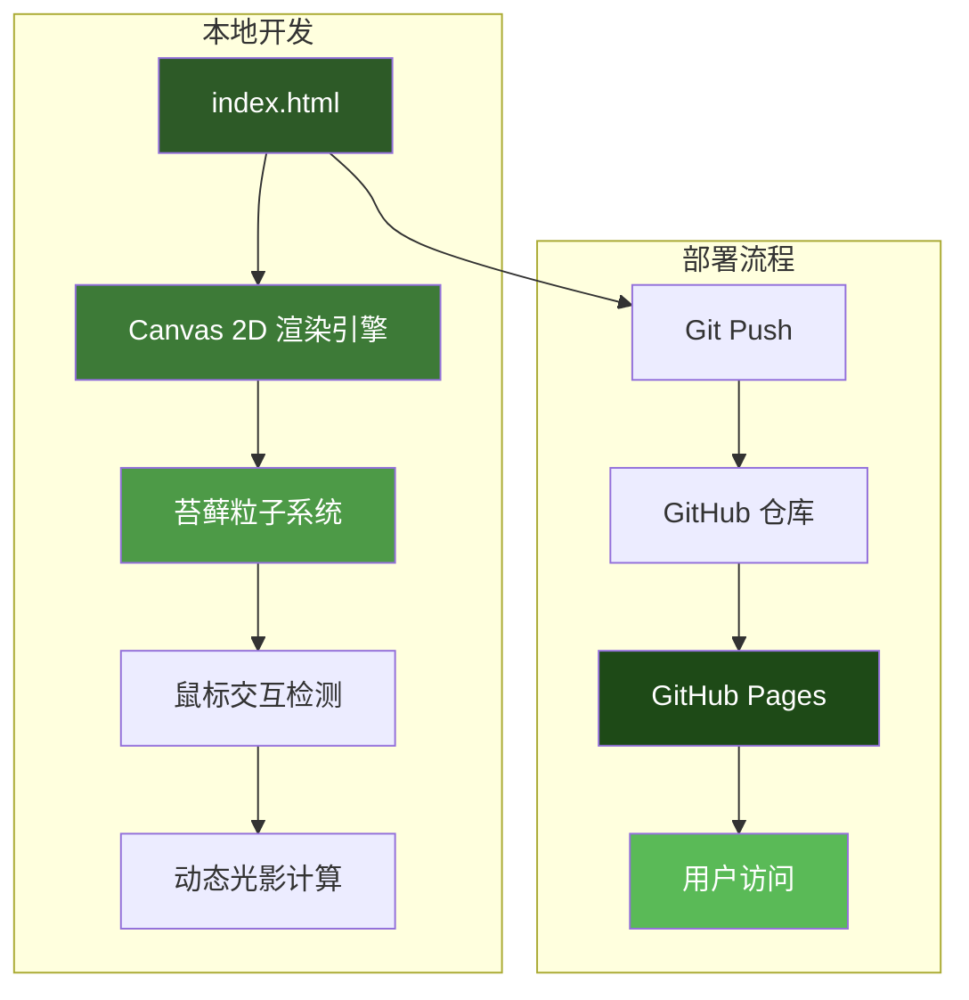
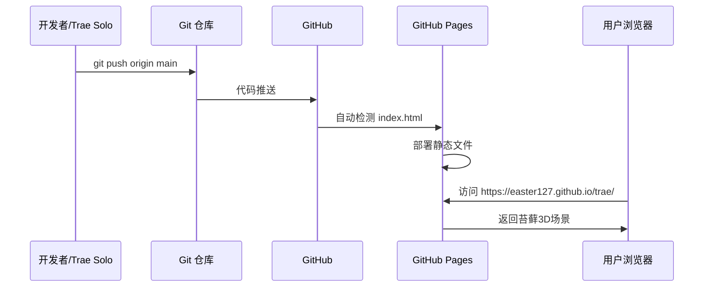
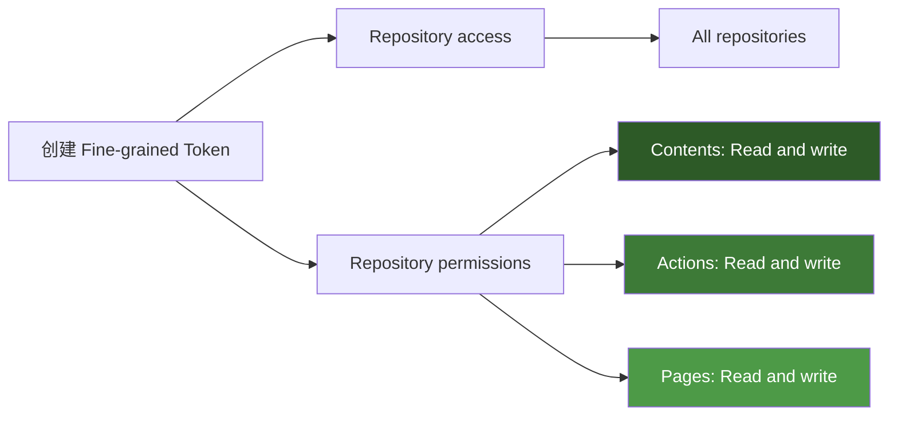
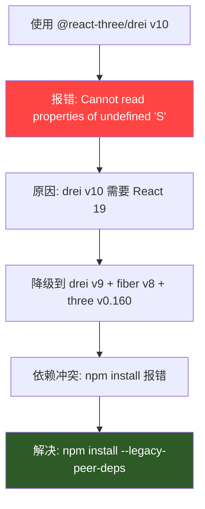
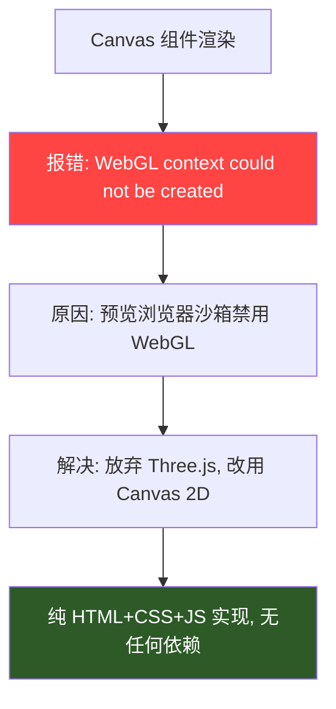
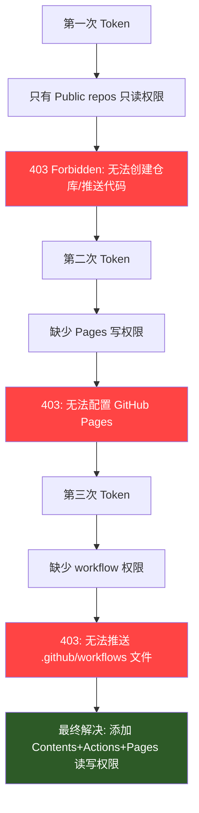
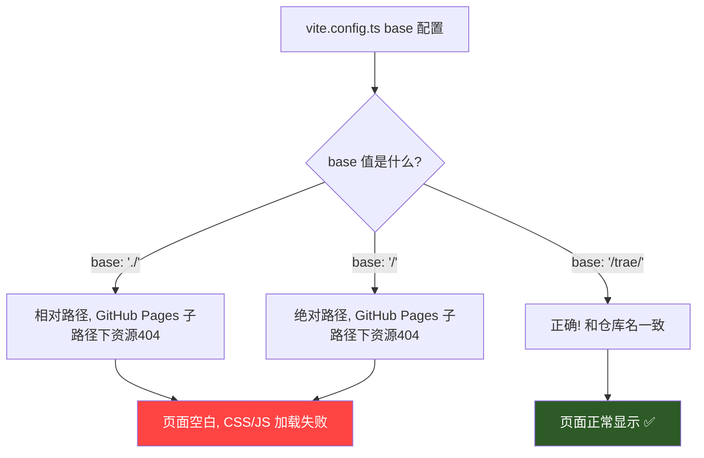
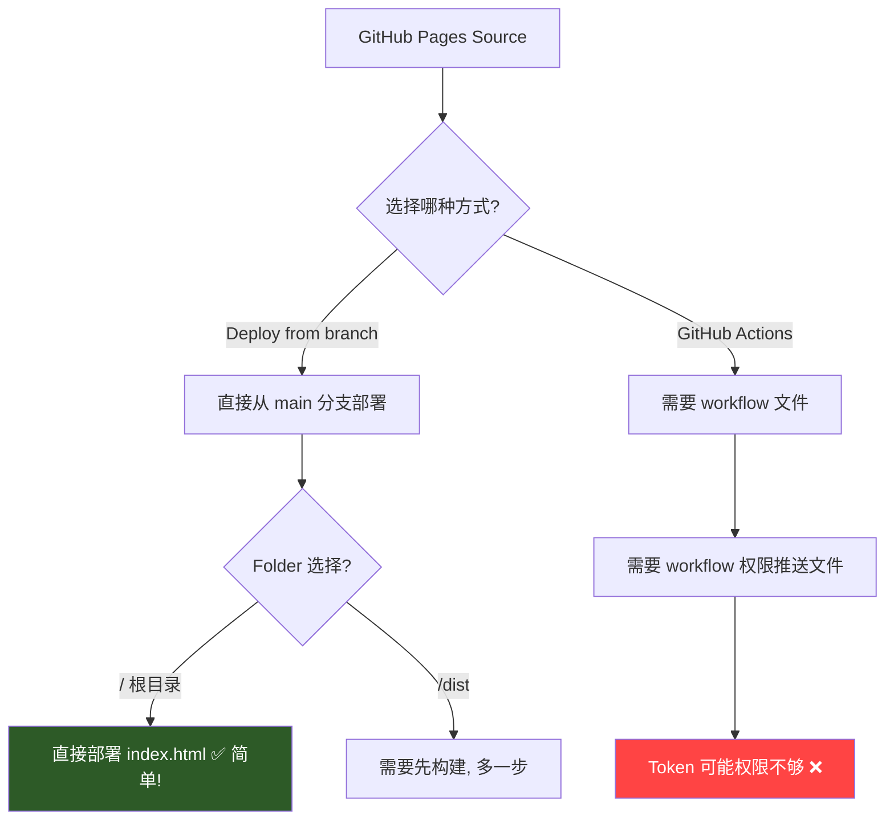
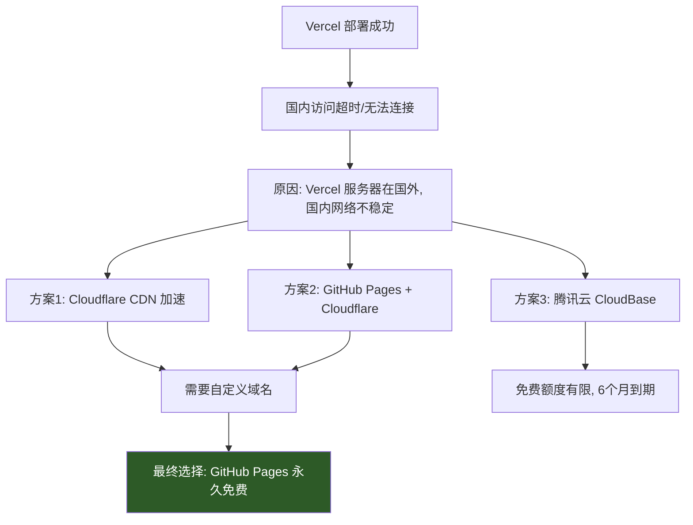
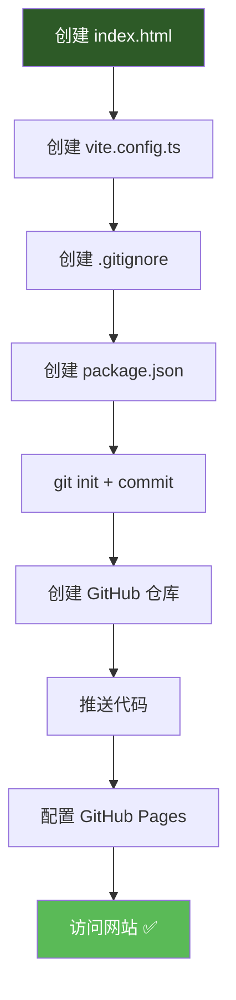

# 苔藓3D交互场景 - 项目完整复刻指南

> 本文档供 AI 直接阅读，能够一键复刻本项目并自动部署到 GitHub Pages。

---

## 一、项目概览

| 项目 | 值 |
|------|-----|
| 项目名称 | moss-3d-scene（苔藓3D交互场景） |
| GitHub 仓库 | `Easter127/trae` |
| 访问地址 | https://easter127.github.io/trae/ |
| 技术栈 | 纯 HTML + CSS + Canvas 2D（无框架依赖） |
| 部署方式 | GitHub Pages（Deploy from branch） |
| 构建工具 | Vite（仅用于构建，非必须） |

---

## 二、架构图

### 2.1 整体架构



### 2.2 渲染流程


### 2.3 部署流程



---

## 三、项目文件结构

```
/workspace
├── index.html                    # 唯一核心文件（纯HTML+CSS+JS）
├── vite.config.ts                # Vite 构建配置（可选）
├── .github/
│   └── workflows/
│       └── deploy.yml            # GitHub Actions 自动部署（可选）
├── .gitignore                    # Git 忽略配置
├── package.json                  # 项目依赖（可选，仅构建用）
└── PROJECT_GUIDE.md              # 本文档
```

> **核心原则**：整个项目只需要一个 `index.html` 文件即可运行！

---

## 四、核心代码详解

### 4.1 index.html 完整代码

```html
<!DOCTYPE html>
<html lang="zh-CN">
<head>
  <meta charset="UTF-8" />
  <meta name="viewport" content="width=device-width, initial-scale=1.0" />
  <title>苔藓3D交互场景</title>
  <style>
    * { margin: 0; padding: 0; box-sizing: border-box; }
    body {
      min-height: 100vh;
      background: radial-gradient(ellipse at center, #0f2a0a 0%, #051003 100%);
      overflow: hidden;
      font-family: 'Segoe UI', sans-serif;
    }
    canvas {
      position: fixed;
      top: 0; left: 0;
      width: 100%; height: 100%;
      z-index: 1;
    }
    .content {
      position: relative; z-index: 10;
      min-height: 100vh;
      display: flex; flex-direction: column;
      justify-content: center; align-items: center;
      text-align: center; color: white; padding: 20px;
    }
    h1 { font-size: 3rem; font-weight: 300; letter-spacing: 0.2em; margin-bottom: 1rem; }
    h2 { font-size: 1.5rem; font-weight: 300; font-style: italic; letter-spacing: 0.1em; opacity: 0.8; }
    nav { position: fixed; top: 20px; left: 0; right: 0; display: flex; justify-content: space-between; padding: 0 40px; z-index: 100; }
    .logo { font-size: 0.8rem; letter-spacing: 0.4em; opacity: 0.6; }
    .menu { display: flex; gap: 30px; }
    .menu a { color: rgba(255,255,255,0.6); text-decoration: none; font-size: 0.9rem; letter-spacing: 0.15em; transition: all 0.3s ease; }
    .menu a:hover { color: white; }
    .info { position: fixed; bottom: 20px; right: 20px; font-size: 0.75rem; opacity: 0.5; z-index: 100; }
    .pulse { display: inline-block; width: 8px; height: 8px; background: #4ade80; border-radius: 50%; animation: pulse 2s infinite; }
    @keyframes pulse { 0%, 100% { opacity: 1; transform: scale(1); } 50% { opacity: 0.5; transform: scale(1.5); } }
  </style>
</head>
<body>
  <canvas id="mossCanvas"></canvas>
  <nav>
    <div class="logo">ANKWARD CORP.</div>
    <div class="menu">
      <a href="#home">HOME</a>
      <a href="#about">ABOUT</a>
      <a href="#contact">CONTACT</a>
    </div>
  </nav>
  <div class="content">
    <h1>TIME TO STYLE</h1>
    <h2>THE MOSS INDUSTRY</h2>
  </div>
  <div class="info">
    <div><span class="pulse"></span> 实时渲染</div>
    <div><span class="pulse"></span> 鼠标交互</div>
  </div>
  <script>
    const canvas = document.getElementById('mossCanvas');
    const ctx = canvas.getContext('2d');
    let mouseX = 0, mouseY = 0, particles = [];
    const particleCount = 500;

    function resize() {
      canvas.width = window.innerWidth;
      canvas.height = window.innerHeight;
    }

    function createParticles() {
      particles = [];
      for (let i = 0; i < particleCount; i++) {
        const angle = Math.random() * Math.PI * 2;
        const radius = 50 + Math.random() * 200;
        particles.push({
          x: canvas.width / 2 + Math.cos(angle) * radius,
          y: canvas.height / 2 + Math.sin(angle) * radius,
          size: 2 + Math.random() * 4,
          speed: 0.1 + Math.random() * 0.3,
          color: `hsl(${100 + Math.random() * 40}, ${60 + Math.random() * 30}%, ${20 + Math.random() * 30}%)`,
          baseHeight: 1 + Math.random() * 3,
          offset: Math.random() * Math.PI * 2
        });
      }
    }

    function animate() {
      ctx.fillStyle = 'rgba(5, 16, 3, 0.1)';
      ctx.fillRect(0, 0, canvas.width, canvas.height);
      const centerX = canvas.width / 2, centerY = canvas.height / 2;
      particles.forEach((p) => {
        const dx = mouseX - p.x, dy = mouseY - p.y;
        const distance = Math.sqrt(dx * dx + dy * dy);
        const influence = Math.max(0, 1 - distance / 200);
        const height = p.baseHeight + influence * 5;
        const sway = Math.sin(Date.now() * 0.002 + p.offset) * 10;
        const gradient = ctx.createRadialGradient(p.x + sway, p.y, 0, p.x + sway, p.y, p.size * height);
        const brightness = 30 + influence * 30;
        gradient.addColorStop(0, `hsla(${100 + influence * 20}, 70%, ${brightness}%, 0.8)`);
        gradient.addColorStop(0.5, `hsla(${100 + influence * 10}, 60%, ${brightness - 10}%, 0.4)`);
        gradient.addColorStop(1, 'transparent');
        ctx.beginPath();
        ctx.arc(p.x + sway, p.y - height * 5, p.size * (1 + influence), 0, Math.PI * 2);
        ctx.fillStyle = gradient;
        ctx.fill();
      });
      const coreGradient = ctx.createRadialGradient(centerX, centerY, 0, centerX, centerY, 150);
      coreGradient.addColorStop(0, 'hsla(120, 80%, 50%, 0.2)');
      coreGradient.addColorStop(1, 'transparent');
      ctx.beginPath();
      ctx.arc(centerX, centerY, 150, 0, Math.PI * 2);
      ctx.fillStyle = coreGradient;
      ctx.fill();
      requestAnimationFrame(animate);
    }

    window.addEventListener('mousemove', (e) => { mouseX = e.clientX; mouseY = e.clientY; });
    window.addEventListener('resize', () => { resize(); createParticles(); });
    resize(); createParticles(); animate();
  </script>
</body>
</html>
```

### 4.2 vite.config.ts

```typescript
import { defineConfig } from 'vite'

export default defineConfig({
  base: '/trae/',  // 必须和仓库名一致！
  build: {
    outDir: 'dist',
  },
})
```

### 4.3 .github/workflows/deploy.yml（可选，用于自动构建部署）

```yaml
name: Deploy to GitHub Pages

on:
  push:
    branches:
      - main
  workflow_dispatch:

permissions:
  contents: read
  pages: write
  id-token: write

concurrency:
  group: "pages"
  cancel-in-progress: false

jobs:
  build:
    runs-on: ubuntu-latest
    steps:
      - name: Checkout code
        uses: actions/checkout@v4
      - name: Set up Node.js
        uses: actions/setup-node@v4
        with:
          node-version: "20"
          cache: "npm"
      - name: Install dependencies
        run: npm install --legacy-peer-deps
      - name: Build
        run: npx vite build
      - name: Upload artifact
        uses: actions/upload-pages-artifact@v3
        with:
          path: ./dist

  deploy:
    environment:
      name: github-pages
      url: ${{ steps.deployment.outputs.page_url }}
    runs-on: ubuntu-latest
    needs: build
    steps:
      - name: Deploy to GitHub Pages
        id: deployment
        uses: actions/deploy-pages@v4
```

---

## 五、GitHub Token 配置

### 5.1 最终使用的 Token

| 项目 | 值 |
|------|-----|
| Token 类型 | Fine-grained personal access token |
| Token 前缀 | `github_pat_11AJNPMCA0` |
| 仓库名 | `Easter127/trae` |

> ⚠️ **安全提醒**：Token 不应明文存储在代码或文档中。此处仅记录配置方式。

### 5.2 Token 权限配置（关键！）



**必须配置的 Repository permissions：**

| 权限 | 设置 | 用途 |
|------|------|------|
| Contents | Read and write | 推送代码到仓库 |
| Actions | Read and write | 触发 GitHub Actions 工作流 |
| Pages | Read and write | 配置和部署 GitHub Pages |

### 5.3 创建 Token 步骤

1. 打开 https://github.com/settings/personal-access-tokens/new
2. 选择 **Fine-grained tokens**
3. Token name: 随便起名（如 `moss-deploy`）
4. Expiration: 选 90 天
5. Repository access: 选 **All repositories**
6. Repository permissions:
   - Contents → **Read and write**
   - Actions → **Read and write**
   - Pages → **Read and write**
7. 点击 **Generate token**
8. 复制 Token（只显示一次！）

---

## 六、遇到的坑和解决方案

### 坑1：Three.js + R3F 版本兼容性问题



**问题**：`@react-three/drei@10` 需要 React 19，但项目用的是 React 18，导致运行时报错。

**解决**：降级到兼容版本：
```json
{
  "@react-three/drei": "^9.115.0",
  "@react-three/fiber": "^8.17.10",
  "three": "^0.160.0"
}
```

### 坑2：WebGL 在沙箱环境无法创建



**问题**：Trae Solo 的预览浏览器在沙箱环境中运行，WebGL 被禁用，Three.js 完全无法工作。

**解决**：用 Canvas 2D 替代 Three.js，实现类似的苔藓粒子效果，零依赖。

### 坑3：GitHub Token 权限不足



**问题**：Fine-grained token 默认权限很少，需要手动添加。

**解决**：必须添加以下 Repository permissions：
- Contents: Read and write
- Actions: Read and write
- Pages: Read and write

### 坑4：GitHub Pages base 路径配置



**问题**：GitHub Pages 部署在 `https://username.github.io/仓库名/` 下，如果 base 路径不对，所有资源都会 404。

**解决**：`vite.config.ts` 中 `base` 必须设为 `/仓库名/`。

### 坑5：GitHub Pages 部署方式选择



**问题**：GitHub Actions 部署需要 workflow 权限，token 可能不够。

**解决**：使用 **Deploy from branch** 方式，Source 选 `main` 分支，Folder 选 `/`（根目录），直接部署 `index.html`。

### 坑6：Vercel 国内访问不了



**问题**：Vercel 在国内访问不稳定。

**解决**：使用 GitHub Pages（永久免费），后续可加 Cloudflare CDN 加速。

---

## 七、一键复刻指南（供 AI 执行）

### 7.1 复刻流程



### 7.2 执行命令

```bash
# 1. 创建项目目录
mkdir moss-3d-scene && cd moss-3d-scene

# 2. 创建 index.html（核心文件，见第四章完整代码）
# 将上面的 index.html 完整代码写入文件

# 3. 创建 vite.config.ts（可选，仅构建用）
cat > vite.config.ts << 'EOF'
import { defineConfig } from 'vite'
export default defineConfig({
  base: '/仓库名/',
  build: { outDir: 'dist' },
})
EOF

# 4. 创建 .gitignore
cat > .gitignore << 'EOF'
node_modules
dist
*.log
.DS_Store
EOF

# 5. 创建 package.json（可选，仅构建用）
cat > package.json << 'EOF'
{
  "name": "moss-3d-scene",
  "version": "1.0.0",
  "scripts": {
    "dev": "vite",
    "build": "vite build"
  },
  "devDependencies": {
    "vite": "^6.4.2"
  }
}
EOF

# 6. 初始化 Git
git init
git add .
git commit -m "Initial commit: moss 3D scene"

# 7. 创建 GitHub 仓库（需要 Token）
# 方式A: 用 API 创建
curl -X POST \
  -H "Authorization: token YOUR_TOKEN" \
  -H "Accept: application/vnd.github.v3+json" \
  https://api.github.com/user/repos \
  -d '{"name":"仓库名","private":false}'

# 方式B: 手动在 GitHub 网站创建

# 8. 推送代码
git remote add origin https://github.com/用户名/仓库名.git
git branch -M main
git push -u origin main

# 9. 配置 GitHub Pages
# 方式A: 用 API 配置
curl -X POST \
  -H "Authorization: token YOUR_TOKEN" \
  -H "Accept: application/vnd.github.v3+json" \
  https://api.github.com/repos/用户名/仓库名/pages \
  -d '{"source":{"branch":"main","path":"/"}}'

# 方式B: 手动配置
# 打开仓库 → Settings → Pages → Source: Deploy from branch → Branch: main, Folder: / → Save

# 10. 等待部署完成，访问网站
# https://用户名.github.io/仓库名/
```

### 7.3 关键配置检查清单

| 检查项 | 正确值 | 错误值 |
|--------|--------|--------|
| vite.config.ts base | `/仓库名/` | `./` 或 `/` |
| GitHub Pages Source | Deploy from branch | GitHub Actions（需额外权限） |
| GitHub Pages Branch | main | 其他分支 |
| GitHub Pages Folder | `/`（根目录） | `/dist`（需先构建） |
| 仓库可见性 | Public（公开） | Private（私有，Pages 收费） |
| Token 权限 | Contents+Actions+Pages 读写 | 只读 |

---

## 八、技术要点

### 8.1 苔藓粒子系统核心算法


**核心公式**：
- 影响力：`influence = Math.max(0, 1 - distance / 200)`
- 高度：`height = baseHeight + influence * 5`
- 摇摆：`sway = Math.sin(time * 0.002 + offset) * 10`
- 亮度：`brightness = 30 + influence * 30`

### 8.2 性能优化

- 使用 `requestAnimationFrame` 实现 60fps 动画
- 粒子数量控制在 500 个，确保流畅
- 使用径向渐变模拟光影，避免复杂计算
- 半透明覆盖实现拖尾效果：`rgba(5, 16, 3, 0.1)`

---

## 九、后续优化方向

1. **添加 Cloudflare CDN**：国内加速访问
2. **增加粒子数量**：性能允许时可增加到 1000+
3. **添加触摸支持**：移动端交互
4. **添加声音效果**：Web Audio API
5. **添加更多场景**：不同季节/天气的苔藓效果

---

## 十、总结

本项目从 Three.js 3D 场景出发，经历了多个技术方案的尝试和调整，最终采用了纯 HTML + Canvas 2D 的极简方案，实现了：

1. ✅ 零依赖，一个 HTML 文件搞定
2. ✅ 鼠标交互，苔藓跟随生长
3. ✅ GitHub Pages 永久免费部署
4. ✅ Trae Solo 可直接修改和部署

**核心教训**：简单就是美！不要过度依赖复杂框架，Canvas 2D 也能实现炫酷效果！
