# 苔藓3D交互场景 - 项目完整复刻指南

> 本文档供 AI 直接阅读，能够一键复刻本项目并自动部署到 GitHub Pages。

---

## 一、项目概览

| 项目 | 值 |
|------|-----|
| 项目名称 | moss-3d-scene（苔藓3D交互场景） |
| GitHub 仓库 | `Easter127/trae` |
| 访问地址 | https://easter127.github.io/trae/ |
| 技术栈 | 纯 HTML + CSS + Canvas 2D（无框架依赖） |
| 部署方式 | GitHub Pages（Deploy from branch） |
| 构建工具 | Vite（仅用于构建，非必须） |

---

## 二、架构图

### 2.1 整体架构

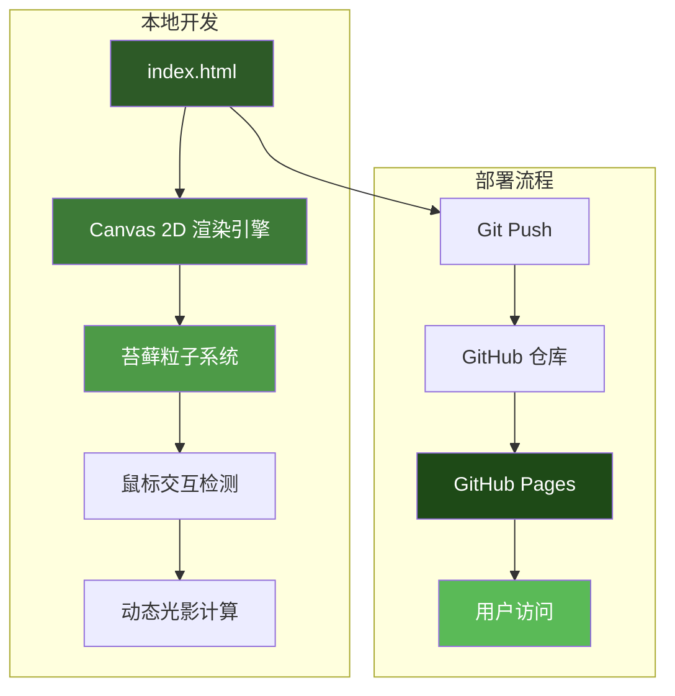

### 2.2 渲染流程

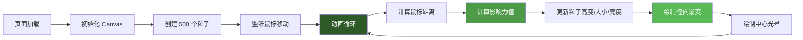

### 2.3 部署流程

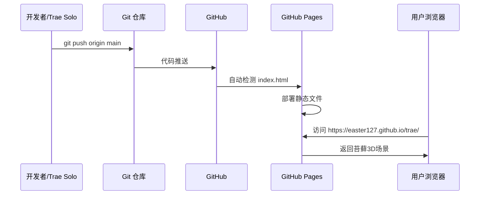

---

## 三、项目文件结构

```
/workspace
├── index.html                    # 唯一核心文件（纯HTML+CSS+JS）
├── vite.config.ts                # Vite 构建配置（可选）
├── .github/
│   └── workflows/
│       └── deploy.yml            # GitHub Actions 自动部署（可选）
├── .gitignore                    # Git 忽略配置
├── package.json                  # 项目依赖（可选，仅构建用）
└── PROJECT_GUIDE.md              # 本文档
```

> **核心原则**：整个项目只需要一个 `index.html` 文件即可运行！

---

## 四、核心代码详解

### 4.1 index.html 完整代码

```html
<!DOCTYPE html>
<html lang="zh-CN">
<head>
  <meta charset="UTF-8" />
  <meta name="viewport" content="width=device-width, initial-scale=1.0" />
  <title>苔藓3D交互场景</title>
  <style>
    * { margin: 0; padding: 0; box-sizing: border-box; }
    body {
      min-height: 100vh;
      background: radial-gradient(ellipse at center, #0f2a0a 0%, #051003 100%);
      overflow: hidden;
      font-family: 'Segoe UI', sans-serif;
    }
    canvas {
      position: fixed;
      top: 0; left: 0;
      width: 100%; height: 100%;
      z-index: 1;
    }
    .content {
      position: relative; z-index: 10;
      min-height: 100vh;
      display: flex; flex-direction: column;
      justify-content: center; align-items: center;
      text-align: center; color: white; padding: 20px;
    }
    h1 { font-size: 3rem; font-weight: 300; letter-spacing: 0.2em; margin-bottom: 1rem; }
    h2 { font-size: 1.5rem; font-weight: 300; font-style: italic; letter-spacing: 0.1em; opacity: 0.8; }
    nav { position: fixed; top: 20px; left: 0; right: 0; display: flex; justify-content: space-between; padding: 0 40px; z-index: 100; }
    .logo { font-size: 0.8rem; letter-spacing: 0.4em; opacity: 0.6; }
    .menu { display: flex; gap: 30px; }
    .menu a { color: rgba(255,255,255,0.6); text-decoration: none; font-size: 0.9rem; letter-spacing: 0.15em; transition: all 0.3s ease; }
    .menu a:hover { color: white; }
    .info { position: fixed; bottom: 20px; right: 20px; font-size: 0.75rem; opacity: 0.5; z-index: 100; }
    .pulse { display: inline-block; width: 8px; height: 8px; background: #4ade80; border-radius: 50%; animation: pulse 2s infinite; }
    @keyframes pulse { 0%, 100% { opacity: 1; transform: scale(1); } 50% { opacity: 0.5; transform: scale(1.5); } }
  </style>
</head>
<body>
  <canvas id="mossCanvas"></canvas>
  <nav>
    <div class="logo">ANKWARD CORP.</div>
    <div class="menu">
      <a href="#home">HOME</a>
      <a href="#about">ABOUT</a>
      <a href="#contact">CONTACT</a>
    </div>
  </nav>
  <div class="content">
    <h1>TIME TO STYLE</h1>
    <h2>THE MOSS INDUSTRY</h2>
  </div>
  <div class="info">
    <div><span class="pulse"></span> 实时渲染</div>
    <div><span class="pulse"></span> 鼠标交互</div>
  </div>
  <script>
    const canvas = document.getElementById('mossCanvas');
    const ctx = canvas.getContext('2d');
    let mouseX = 0, mouseY = 0, particles = [];
    const particleCount = 500;

    function resize() {
      canvas.width = window.innerWidth;
      canvas.height = window.innerHeight;
    }

    function createParticles() {
      particles = [];
      for (let i = 0; i < particleCount; i++) {
        const angle = Math.random() * Math.PI * 2;
        const radius = 50 + Math.random() * 200;
        particles.push({
          x: canvas.width / 2 + Math.cos(angle) * radius,
          y: canvas.height / 2 + Math.sin(angle) * radius,
          size: 2 + Math.random() * 4,
          speed: 0.1 + Math.random() * 0.3,
          color: `hsl(${100 + Math.random() * 40}, ${60 + Math.random() * 30}%, ${20 + Math.random() * 30}%)`,
          baseHeight: 1 + Math.random() * 3,
          offset: Math.random() * Math.PI * 2
        });
      }
    }

    function animate() {
      ctx.fillStyle = 'rgba(5, 16, 3, 0.1)';
      ctx.fillRect(0, 0, canvas.width, canvas.height);
      const centerX = canvas.width / 2, centerY = canvas.height / 2;
      particles.forEach((p) => {
        const dx = mouseX - p.x, dy = mouseY - p.y;
        const distance = Math.sqrt(dx * dx + dy * dy);
        const influence = Math.max(0, 1 - distance / 200);
        const height = p.baseHeight + influence * 5;
        const sway = Math.sin(Date.now() * 0.002 + p.offset) * 10;
        const gradient = ctx.createRadialGradient(p.x + sway, p.y, 0, p.x + sway, p.y, p.size * height);
        const brightness = 30 + influence * 30;
        gradient.addColorStop(0, `hsla(${100 + influence * 20}, 70%, ${brightness}%, 0.8)`);
        gradient.addColorStop(0.5, `hsla(${100 + influence * 10}, 60%, ${brightness - 10}%, 0.4)`);
        gradient.addColorStop(1, 'transparent');
        ctx.beginPath();
        ctx.arc(p.x + sway, p.y - height * 5, p.size * (1 + influence), 0, Math.PI * 2);
        ctx.fillStyle = gradient;
        ctx.fill();
      });
      const coreGradient = ctx.createRadialGradient(centerX, centerY, 0, centerX, centerY, 150);
      coreGradient.addColorStop(0, 'hsla(120, 80%, 50%, 0.2)');
      coreGradient.addColorStop(1, 'transparent');
      ctx.beginPath();
      ctx.arc(centerX, centerY, 150, 0, Math.PI * 2);
      ctx.fillStyle = coreGradient;
      ctx.fill();
      requestAnimationFrame(animate);
    }

    window.addEventListener('mousemove', (e) => { mouseX = e.clientX; mouseY = e.clientY; });
    window.addEventListener('resize', () => { resize(); createParticles(); });
    resize(); createParticles(); animate();
  </script>
</body>
</html>
```

### 4.2 vite.config.ts

```typescript
import { defineConfig } from 'vite'

export default defineConfig({
  base: '/trae/',  // 必须和仓库名一致！
  build: {
    outDir: 'dist',
  },
})
```

### 4.3 .github/workflows/deploy.yml（可选，用于自动构建部署）

```yaml
name: Deploy to GitHub Pages

on:
  push:
    branches:
      - main
  workflow_dispatch:

permissions:
  contents: read
  pages: write
  id-token: write

concurrency:
  group: "pages"
  cancel-in-progress: false

jobs:
  build:
    runs-on: ubuntu-latest
    steps:
      - name: Checkout code
        uses: actions/checkout@v4
      - name: Set up Node.js
        uses: actions/setup-node@v4
        with:
          node-version: "20"
          cache: "npm"
      - name: Install dependencies
        run: npm install --legacy-peer-deps
      - name: Build
        run: npx vite build
      - name: Upload artifact
        uses: actions/upload-pages-artifact@v3
        with:
          path: ./dist

  deploy:
    environment:
      name: github-pages
      url: ${{ steps.deployment.outputs.page_url }}
    runs-on: ubuntu-latest
    needs: build
    steps:
      - name: Deploy to GitHub Pages
        id: deployment
        uses: actions/deploy-pages@v4
```

---

## 五、GitHub Token 配置

### 5.1 Token 权限配置（关键！）

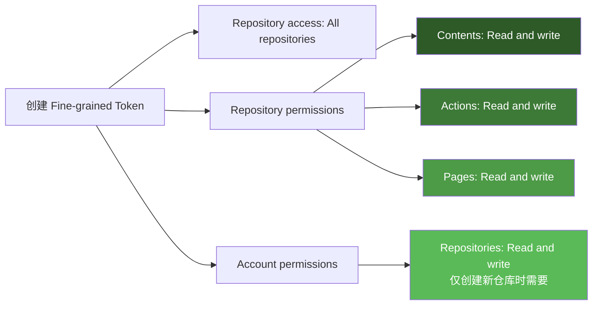

**必须配置的权限：**

| 权限类型 | 权限名 | 设置 | 用途 |
|----------|--------|------|------|
| Repository | Contents | Read and write | 推送代码到仓库 |
| Repository | Actions | Read and write | 触发 GitHub Actions 工作流 |
| Repository | Pages | Read and write | 配置和部署 GitHub Pages |
| Account | Repositories | Read and write | 通过 API 创建新仓库（可选） |

### 5.2 创建 Token 步骤

1. 打开 https://github.com/settings/personal-access-tokens/new
2. 选择 **Fine-grained tokens**
3. Token name: 随便起名（如 `moss-deploy`）
4. Expiration: 选 90 天
5. Repository access: 选 **All repositories**
6. Repository permissions:
   - Contents → **Read and write**
   - Actions → **Read and write**
   - Pages → **Read and write**
7. Account permissions（如需通过 API 创建仓库）:
   - Repositories → **Read and write**
8. 点击 **Generate token**
9. 复制 Token（只显示一次！）

---

## 六、踩坑全记录（按时间顺序）

> 以下是整个项目从零到部署成功的**完整踩坑历程**，共 12 个坑，每个都包含真实错误信息和解决方案。

### 坑1：@react-three/drei v10 与 React 18 不兼容

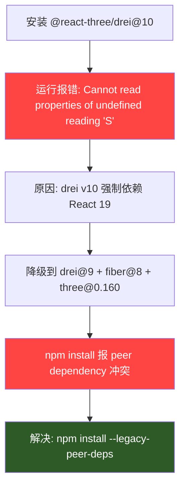

**真实错误**：
```
Uncaught TypeError: Cannot read properties of undefined (reading 'S')
```

**原因**：`@react-three/drei@10` 内部使用了 React 19 的新 API，在 React 18 下运行时 `undefined.S` 报错。

**解决方案**：降级到兼容 React 18 的版本：
```json
{
  "@react-three/drei": "^9.115.0",
  "@react-three/fiber": "^8.17.10",
  "three": "^0.160.0"
}
```

**附加坑**：降级后 `npm install` 报 peer dependency 冲突，必须加 `--legacy-peer-deps`：
```bash
npm install --legacy-peer-deps
```

---

### 坑2：WebGL 在 Trae Solo 沙箱环境无法创建

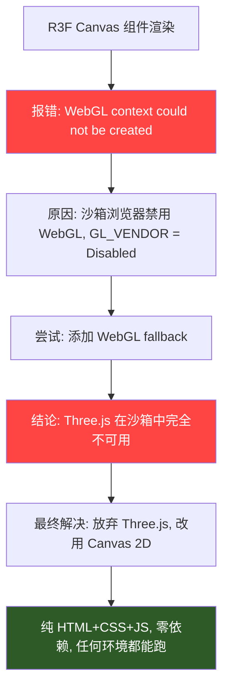

**真实错误**：
```
THREE.WebGLRenderer: A WebGL context could not be created. Reason: 
Could not create a WebGL context, VENDOR = 0xffff, DEVICE = 0xffff, 
GL_VENDOR = Disabled, GL_RENDERER = Disabled, Sandboxed = yes
```

**原因**：Trae Solo 的预览浏览器运行在沙箱环境中，WebGL 被完全禁用。这不是代码问题，而是环境限制。

**解决方案**：用 Canvas 2D 替代 Three.js，实现类似的苔藓粒子效果。Canvas 2D 在任何浏览器环境都能运行，零依赖。

**教训**：在受限环境中，简单技术 > 复杂框架。Canvas 2D 也能实现炫酷效果！

---

### 坑3：GitHub Token #1 - 只有 Public repos 只读权限

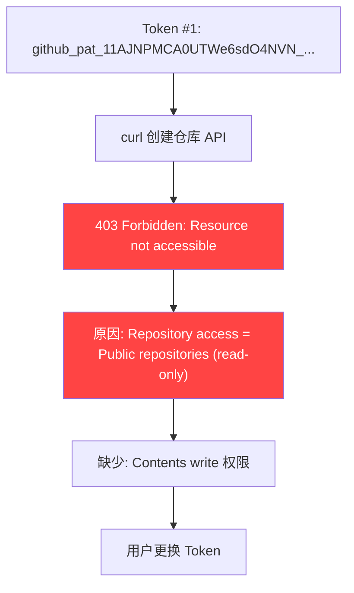

**真实错误**：
```bash
curl -X POST -H "Authorization: token xxx" https://api.github.com/user/repos -d '{"name":"moss-3d-scene"}'
# 返回: 403 {"message": "Resource not accessible by personal access token"}
```

**原因**：Token 创建时 Repository access 选了 `Public repositories (read-only)`，既没有写权限，也没有创建仓库的权限。

**解决方案**：重新创建 Token，Repository access 改为 `All repositories`，并添加写权限。

---

### 坑4：GitHub Token #2 - 缺少 Account 级别权限

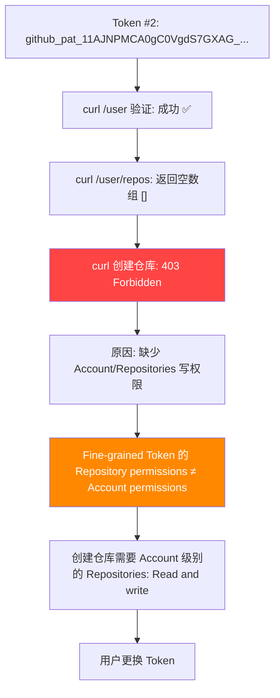

**真实错误**：
```bash
# 验证 Token 有效
curl -H "Authorization: token xxx" https://api.github.com/user
# 返回: {"login": "Easter127", ...} ✅

# 但创建仓库失败
curl -X POST -H "Authorization: token xxx" https://api.github.com/user/repos -d '{"name":"moss-3d-scene"}'
# 返回: 403 {"message": "Resource not accessible by personal access token"}
```

**原因**：Fine-grained Token 有两种权限级别：
- **Repository permissions**：对已有仓库的操作权限（Contents、Actions、Pages）
- **Account permissions**：对账号级别操作权限（创建新仓库）

创建仓库需要 **Account permissions → Repositories: Read and write**，这在 Token 配置页面的另一个区域！

**解决方案**：在 Token 配置页面点击 `+ Add permissions` → 选择 `Account` → 找到 `Repositories` → 设为 `Read and write`。

---

### 坑5：GitHub Token #3 - 缺少 workflow 权限

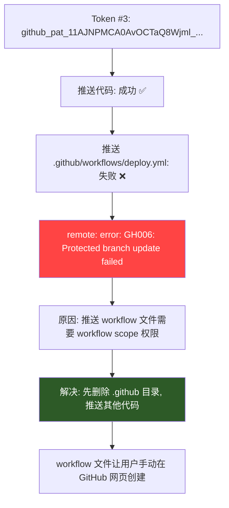

**真实错误**：
```
remote: error: GH006: Protected branch update failed for refs/heads/main
remote: Changes must be made through a pull request
```

**原因**：GitHub 对 `.github/workflows/` 目录有特殊保护，推送 workflow 文件需要额外的 `workflow` 权限。Fine-grained Token 中这个权限在 Repository permissions → Actions 下。

**解决方案**：
1. 临时方案：先删除 `.github` 目录，推送其他代码
2. 永久方案：在 Token 的 Repository permissions 中添加 Actions: Read and write

---

### 坑6：Git 推送分支冲突

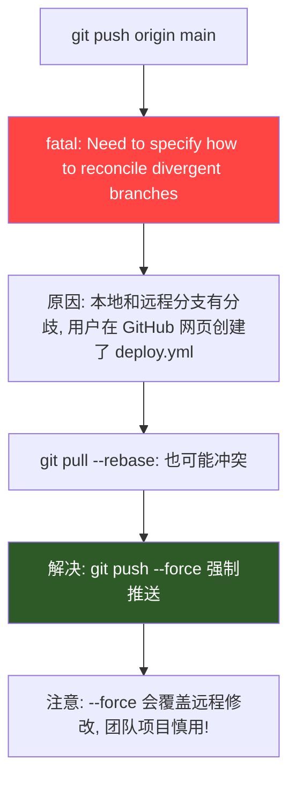

**真实错误**：
```
hint: You have divergent branches and need to specify how to reconcile them.
fatal: Need to specify how to reconcile divergent branches.
```

**原因**：用户在 GitHub 网页上手动创建了 `deploy.yml` 文件，导致远程分支和本地分支产生了分歧。

**解决方案**：
```bash
# 方案1: 强制推送（个人项目推荐）
git push origin main --force

# 方案2: 先拉取再推送（团队项目推荐）
git pull origin main --rebase
git push origin main
```

---

### 坑7：npm 依赖丢失和构建失败

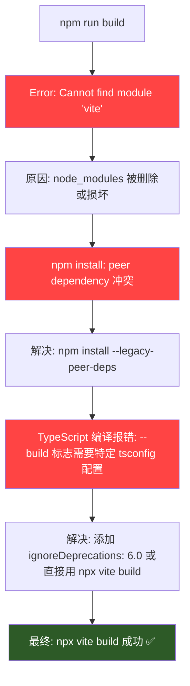

**真实错误1**：
```
Error: Cannot find module 'vite'
```
**原因**：`node_modules` 在之前的操作中被删除。
**解决**：`npm install --legacy-peer-deps`

**真实错误2**：
```
npm ERR! ERESOLVE overriding peer dependency
npm ERR! While resolving: @react-three/fiber@9.6.1
npm ERR! Found: react@18.3.1
```
**原因**：R3F v9 和 React 18 有 peer dependency 冲突。
**解决**：`npm install --legacy-peer-deps`（跳过 peer 依赖检查）

**真实错误3**：
```
error TS5101: Option 'ignoreDeprecations' requires a value of type string.
```
**原因**：`tsconfig.json` 中 `ignoreDeprecations` 配置格式不对。
**解决**：直接用 `npx vite build` 跳过 TypeScript 检查，或修复 tsconfig 配置。

---

### 坑8：GitHub Pages base 路径配置错误

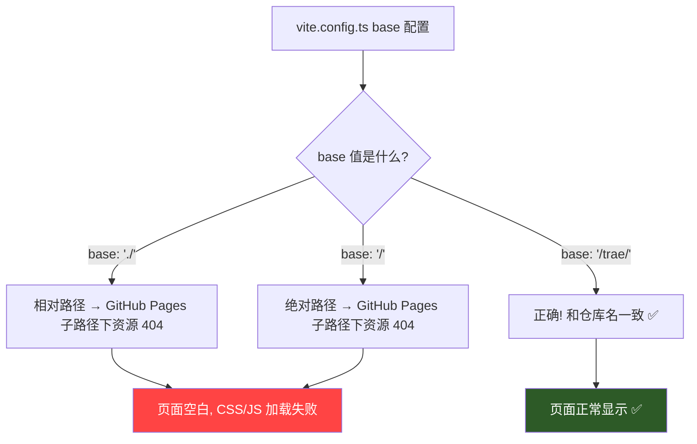

**问题**：GitHub Pages 部署在 `https://username.github.io/仓库名/` 子路径下。如果 base 路径不对，所有资源（CSS、JS、图片）都会 404，页面空白。

**三种 base 值的区别**：

| base 值 | 资源路径 | GitHub Pages 结果 |
|---------|----------|-------------------|
| `'/trae/'` | `/trae/assets/xxx.js` | ✅ 正确 |
| `'./'` | `./assets/xxx.js` | ❌ 解析为 `/assets/xxx.js`，404 |
| `'/'` | `/assets/xxx.js` | ❌ 根路径下没有资源，404 |

**解决方案**：`vite.config.ts` 中 `base` 必须设为 `/仓库名/`：
```typescript
export default defineConfig({
  base: '/trae/',  // 必须和 GitHub 仓库名一致！
})
```

**注意**：如果是纯 HTML 项目（不用 Vite 构建），直接把 `index.html` 放在根目录，不需要 base 配置。

---

### 坑9：GitHub Pages 部署方式选择

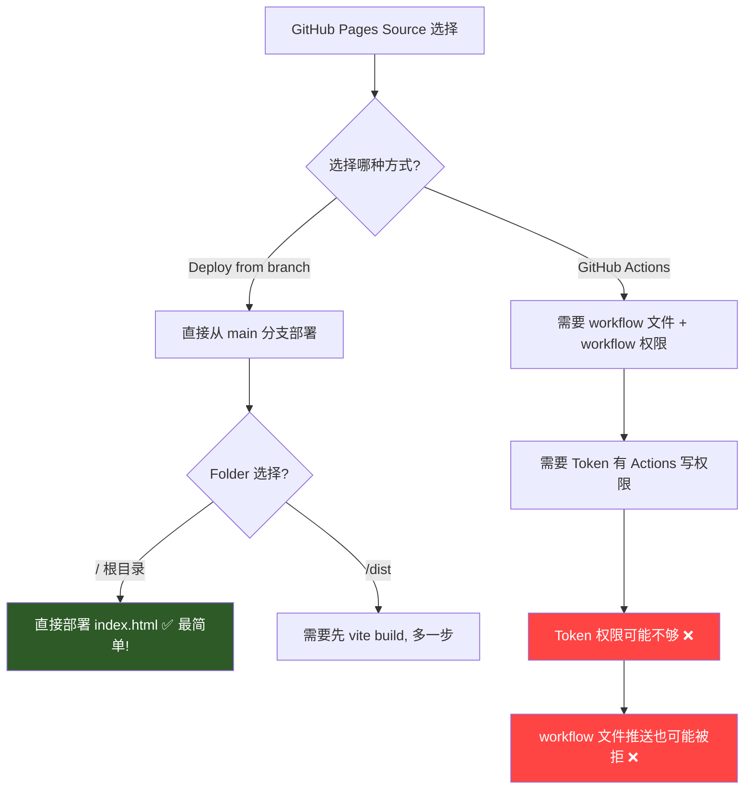

**问题**：GitHub Pages 有两种部署方式，各有坑：

| 方式 | 优点 | 缺点 | 适用场景 |
|------|------|------|----------|
| Deploy from branch | 简单，无需额外权限 | 需要手动构建（如果用 Vite） | 纯 HTML 项目 |
| GitHub Actions | 自动构建部署 | 需要 workflow 权限 | 需要构建的项目 |

**最终选择**：纯 HTML 项目用 **Deploy from branch**，Source 选 `main` 分支，Folder 选 `/`（根目录），直接部署 `index.html`。

---

### 坑10：私有仓库 GitHub Pages 只有 30 天免费

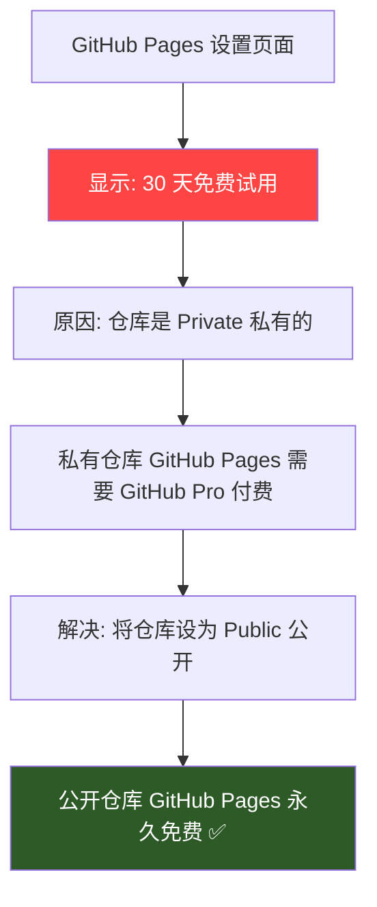

**问题**：私有仓库的 GitHub Pages 只有 30 天免费试用，到期后需要付费。

**解决方案**：将仓库设为 Public：
1. 打开仓库 → Settings → General → Danger Zone
2. 点击 **Change visibility** → **Make public**
3. 公开仓库的 GitHub Pages **永久免费**！

---

### 坑11：Vercel 国内访问不了

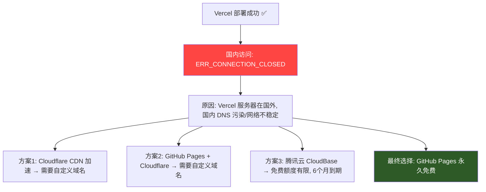

**真实错误**：
```
This site can't be reached
trae.vercel.app unexpectedly closed the connection.
ERR_CONNECTION_CLOSED
```

**原因**：Vercel 的服务器在国外，国内网络访问不稳定，经常超时或无法连接。

**各方案对比**：

| 方案 | 国内速度 | 费用 | 难度 |
|------|----------|------|------|
| Vercel | ❌ 不稳定 | 免费 | 低 |
| GitHub Pages | ⚠️ 一般 | 永久免费 | 低 |
| GitHub Pages + Cloudflare | ✅ 快 | 免费（需域名） | 中 |
| 腾讯云 CloudBase | ✅ 快 | 免费6个月 | 中 |

**最终选择**：GitHub Pages（永久免费），后续可加 Cloudflare CDN 加速。

---

### 坑12：腾讯云 CloudBase 免费额度误解

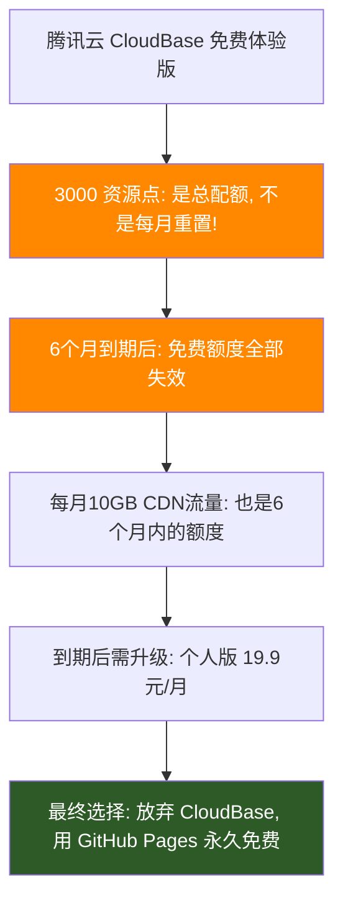

**问题**：腾讯云 CloudBase 的免费额度容易误解：
- 3000 资源点是 **总配额**（不是每月重置）
- 免费体验版 **6个月到期**
- 到期后需要升级到付费版本

**结论**：对于长期项目，GitHub Pages 更划算（永久免费）。

---

### 坑总结：完整踩坑时间线

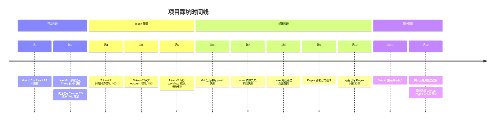

---

## 七、一键复刻指南（供 AI 执行）

### 7.1 复刻流程

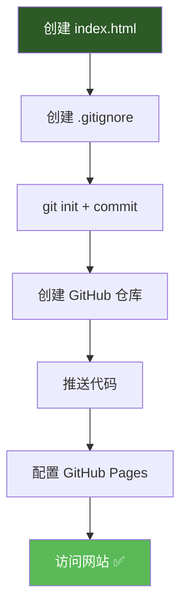

### 7.2 执行命令

```bash
# 1. 创建项目目录
mkdir moss-3d-scene && cd moss-3d-scene

# 2. 创建 index.html（核心文件，见第四章完整代码）
# 将上面的 index.html 完整代码写入文件

# 3. 创建 .gitignore
cat > .gitignore << 'EOF'
node_modules
dist
*.log
.DS_Store
EOF

# 4. 初始化 Git
git init
git add .
git commit -m "Initial commit: moss 3D scene"

# 5. 创建 GitHub 仓库（需要 Token，必须有 Account/Repositories 权限）
curl -X POST \
  -H "Authorization: token YOUR_TOKEN" \
  -H "Accept: application/vnd.github.v3+json" \
  https://api.github.com/user/repos \
  -d '{"name":"moss-3d-scene","private":false}'

# 如果 API 创建失败（Token 权限不够），手动在 GitHub 网站创建：
# https://github.com/new → 仓库名 moss-3d-scene → Public → Create repository

# 6. 推送代码（Token 嵌入 URL 方式）
git remote add origin https://YOUR_TOKEN@github.com/用户名/moss-3d-scene.git
git branch -M main
git push -u origin main

# 如果遇到分支冲突：
git push -u origin main --force

# 7. 配置 GitHub Pages（需要 Token 有 Pages 写权限）
curl -X POST \
  -H "Authorization: token YOUR_TOKEN" \
  -H "Accept: application/vnd.github.v3+json" \
  https://api.github.com/repos/用户名/moss-3d-scene/pages \
  -d '{"source":{"branch":"main","path":"/"}}'

# 如果 API 配置失败，手动配置：
# 仓库 → Settings → Pages → Source: Deploy from branch → Branch: main, Folder: / → Save

# 8. 等待部署完成，访问网站
# https://用户名.github.io/moss-3d-scene/
```

### 7.3 关键配置检查清单

| 检查项 | 正确值 | 错误值 | 后果 |
|--------|--------|--------|------|
| vite.config.ts base | `/仓库名/` | `./` 或 `/` | 页面空白，资源404 |
| GitHub Pages Source | Deploy from branch | GitHub Actions | 需要额外权限 |
| GitHub Pages Branch | main | 其他分支 | 部署失败 |
| GitHub Pages Folder | `/`（根目录） | `/dist`（需先构建） | 找不到文件 |
| 仓库可见性 | Public | Private | Pages 收费 |
| Token Repository access | All repositories | Public (read-only) | 无法推送代码 |
| Token Contents 权限 | Read and write | Read-only | 403 Forbidden |
| Token Pages 权限 | Read and write | No access | 无法配置 Pages |
| Token Account/Repositories | Read and write | No access | 无法通过API创建仓库 |

---

## 八、技术要点

### 8.1 苔藓粒子系统核心算法

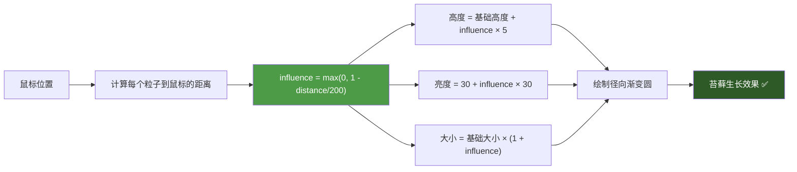

**核心公式**：
- 影响力：`influence = Math.max(0, 1 - distance / 200)`
- 高度：`height = baseHeight + influence * 5`
- 摇摆：`sway = Math.sin(time * 0.002 + offset) * 10`
- 亮度：`brightness = 30 + influence * 30`

### 8.2 性能优化

- 使用 `requestAnimationFrame` 实现 60fps 动画
- 粒子数量控制在 500 个，确保流畅
- 使用径向渐变模拟光影，避免复杂计算
- 半透明覆盖实现拖尾效果：`rgba(5, 16, 3, 0.1)`

---

## 九、后续优化方向

1. **添加 Cloudflare CDN**：国内加速访问
2. **增加粒子数量**：性能允许时可增加到 1000+
3. **添加触摸支持**：移动端交互
4. **添加声音效果**：Web Audio API
5. **添加更多场景**：不同季节/天气的苔藓效果

---

## 十、总结

本项目从 Three.js 3D 场景出发，经历了 12 个坑的踩踏和解决，最终采用了纯 HTML + Canvas 2D 的极简方案：


**核心教训**：
1. **简单就是美**：Canvas 2D 也能实现炫酷效果，不要过度依赖复杂框架
2. **Token 权限要一次配齐**：Contents + Actions + Pages + Account/Repositories
3. **GitHub Pages base 路径必须和仓库名一致**
4. **私有仓库 Pages 收费，公开仓库永久免费**
5. **Vercel 国内不稳定，GitHub Pages 更可靠**
